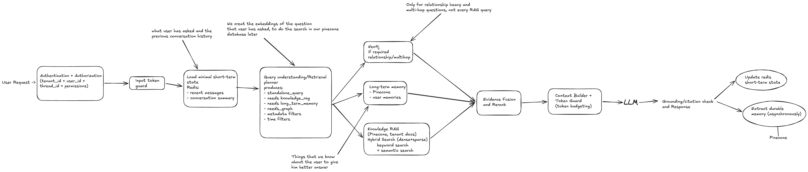
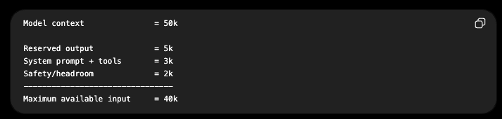

## Multi-Tenant Conversational RAG Architecture with Agent Memory

-> One arrow from 'Query Understanding' to knowledge RAG is missing here.

- It is a production-grade, multi-tenant RAG & Memory Architecture
- We have covered a lot of things in it: tenant isolation, RAG, token management, memory, knowledge graphs, grounding and asynchronous memory persistence.

#### ALGORITHM (Brief Version)
1. **Authenticate and authorize** the request and derive tenant_id, user_id, thread_id and permissions so retrieval is always tenant-isolated.
2. **Validate input token size** and load the short-term memory from Redis (which includes recent messages and conversation summary).
3. **Query understanding/retrieval planner** decides whether we need to have RAG knowledge, Neo4j, long-term memory or a combination of them.
4. Run required retrievals in parallel:
    - Pinecone long-term memory for relevant user memories
    - Pinecone hybrid search - semantic + keyword search - for tenant documents
    - Neo4j only for relationship-heavy or multi-hop questions.
5. Fuse and rerank all retrieved evidence based on the relevance to the standalone query, keeping only the strongest candidates. **Ranking and Fusion here**
6. **Context Builder** -  combines recent conversation, relevant long-term memories, RAG chunks, and graph evidence while deduplicating and respecting the model's token budget.
    - If context is too large then summarise past conversations, remove low-rank evidence, or compress retrieved chunks.
7. Send the final context to the LLM, then perform grounding and citation checks before returning the response.
8. After the response, update the short-term memory (Redis state) and asynchronously extract any durable semantic/episodic memories worth storing in Pinecone (long-term memory).

#### How are we validating input and output tokens?
- Suppose model context window is 50k tokens.
- Then we should not allow the user to consume all 50k tokens, because that window must also contain:-
    - System prompt
    - user prompt
    - Conversation history
    - RAG Context (knowledge)
    - long-term memories
    - model output

- So you define your own budget, something like this:-
    
- And within even that 40k you are restricting the current user message futher:-
    `MAX_USER_INPUT = 10k tokens`

#### How do we actually count tokens?
- Use the tokenizer curresponding to your model/provider.

Conceptually:-

token_count = tokenizer.count(user_input)
if token_count > MAX_USER_INPUT:
    raise InputTooLargeError()

- For OpenAI models, `tiktoken` or the provider's token counting facilities are commonly used.
- So, if allowed user input = 10k, but user entered 60k. You reject ot before calling the LLM.
- Or for files/documents, instead of putting all 60k into chat:-

60k document -> ingestion pipeline -> chunk -> embed -> Pinecone

#### What actually happens in 'Query Understanding' part?
- We are generally sending the query to LLM first for understanding/routing and only after that create embeddings for retrieval.

Step A: Query Understanding / planner
Input to LLM:-

`
Recent Conversation: 