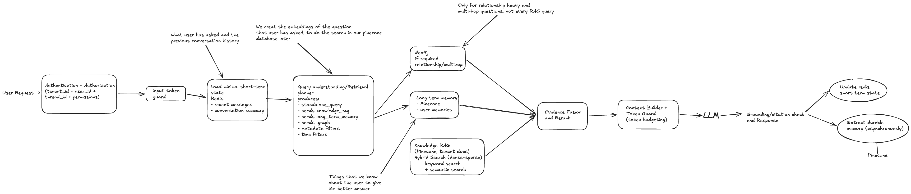

## Multi-Tenant Conversational RAG Architecture with Agent Memory

- It is a production-grade, multi-tenant RAG & Memory Architecture
- We have covered a lot of things in it: tenant isolation, RAG, token management, memory, knowledge graphs, grounding and asynchronous memory persistence.

#### ALGORITHM (Brief Version)
1. Authenticate and authorize the request and derive tenant_id, user_id, thread_id and permissions so retrieval is always tenant-isolated.
2. Validate input token size and load the short-term memory from Redis (which includes recent messages and conversation summary).
3. Query understanding/retrieval planner decides whether we need to have RAG knowledge, Neo4j, long-term memory or a combination of them.
4. Run required retrievals in parallel:
    - Pinecone long-term memory for relevant user memories
    - Pinecone hybrid search - semantic + keyword search - for tenant documents
    - Neo4j only for relationship-heavy or multi-hop questions.
5. Fuse and rerank all retrieved evidence based on the relevance to the standalone query, keeping only the strongest candidates.
6. The context builder combines recent conversation, relevant long-term memories, RAG chunks, and graph evidence while deduplicating and respecting the model's token budget.
    - If context is too large then summarise past conversations, remove low-rank evidence, or compress retrieved chunks.
7. Send the final context to the LLM, then perform grounding and citation checks before returning the response.
8. After the response, update the short-term memory (Redis state) and asynchronously extract any durable semantic/episodic memories worth storing in Pinecone (long-term memory)
